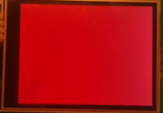

# ili9341-spi-example

Example of using [ili9341-spi-driver](https://bitbucket-prod.tcc.etn.com/projects/SID/repos/ili9341-spi-driver/browse) on STM32F429I
discovery kit.

## Overview

This is a testing and example project to test the [ili9341-spi-driver]()
on STM32F429I discovery kit.

The project is using STM32CubeIDE, STM32CubeMX generated code skeleton and HAL layer as basis and can be used as quick to run
reference of how to use the [ili9341-spi-driver](https://bitbucket-prod.tcc.etn.com/projects/SID/repos/ili9341-spi-driver/browse).

The application inistantiates one display driver instance and loop over the following steps to test the API functions:

* Fill screen RED, GREEN, BLUE colors
* Animate growing box on WHITE background
* Split the screen into frour regions filled with different colors
* Rotate the screen to all orientations
* Draw fullscreen bitmap image

